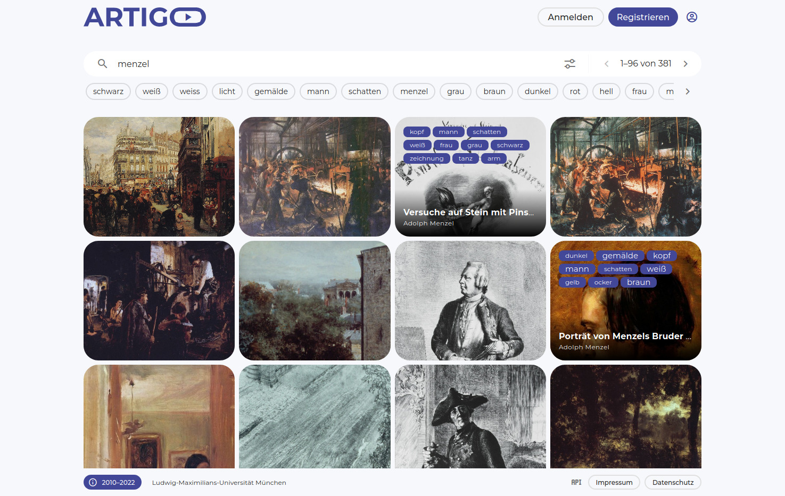

# *ARTigo* – Social Image Tagging

<p float="left">
	
	 
	
</p>

<p float="left">
	
	 
	
</p>


[](https://github.com/arthist-lmu/artigo/actions/workflows/build-web-testing.yml)
[](https://github.com/arthist-lmu/artigo/actions/workflows/build-api-testing.yml)
[](https://github.com/arthist-lmu/artigo/actions/workflows/build-search-testing.yml)

## Development setup

### Requirements
* [docker](https://docs.docker.com/get-docker/)
* [docker-compose](https://docs.docker.com/compose/install/)

### Configuration files
Copy the contents of `.env.example` to `.env` and adjust the settings.

### Setup process
1. To import data, `.csv` and `.jsonl` files should be stored in the `./dump` and corresponding `.jpg` files in the `./media` folder.

2. Build and start the container:
	```sh
	sudo docker-compose up --build
	```

3. Install `npm`:
	```sh
	sudo docker-compose exec web npm install
	```

4. Apply necessary Django operations and import fixtures:
	```sh
	sudo docker-compose exec api python3 manage.py migrate
	sudo docker-compose exec api python3 manage.py loaddata sites.json
	```

5. Import the data into `api` and `search`:
	```sh
	sudo docker-compose exec api python3 manage.py import_data
	sudo docker-compose exec search python3 -m artigo_search --mode client --task insert
	```

6. Create the unprivileged artigo user and group to own the files:
	```sh
	addgroup --system --gid 1998 artigo \
    && adduser --system --uid 1999 --ingroup artigo artigo
	```


## Miscellaneous

### Code reloading
Hot reloading is enabled for `api`. To display changes of `web` (`http://localhost:8080/`), run:
```sh
sudo docker-compose exec web npm run build
```

Alternatively, use `serve` to enable a hot reloaded instance on `http://localhost:8081/`:
```sh
sudo docker-compose exec web npm run serve
```

### Schema updating
To re-generate the OpenAPI 3.0 schema file, use the following command:
```sh
sudo docker-compose exec api python3 manage.py spectacular --file schema.yml
```

### Formatting
Lint can be used to help with standardized formatting:
```sh
sudo docker-compose exec web npm run lint --fix
```


## Contributing

Please report issues, feature requests, and questions to the [GitHub issue tracker](https://github.com/arthist-lmu/artigo/issues). We have a [Contributor Code of Conduct](https://github.com/arthist-lmu/artigo/blob/master/CODE_OF_CONDUCT.md). By participating in ARTigo you agree to abide by its terms.
